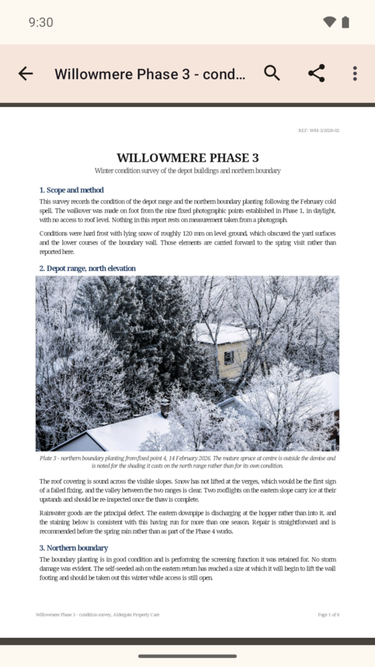
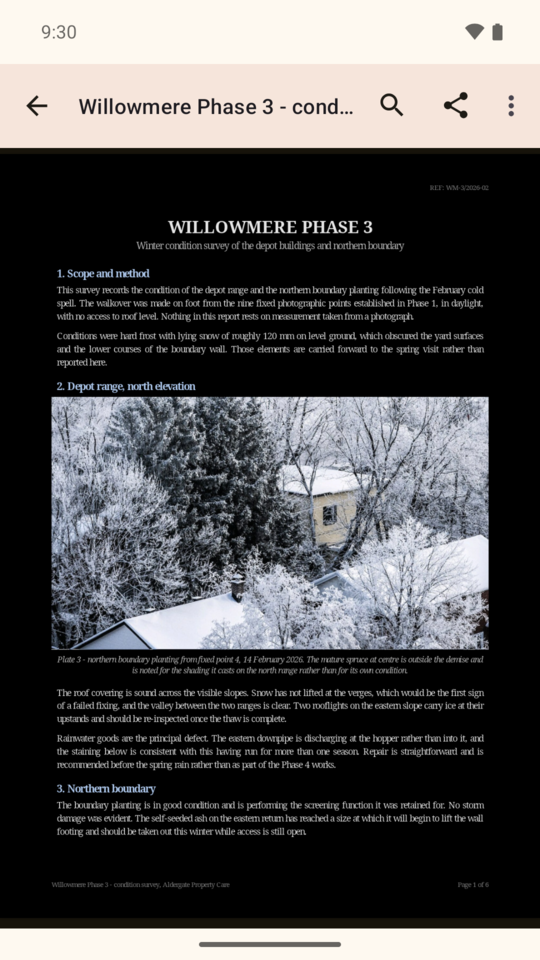

<p align="center">
  
</p>

<p align="center">
  <a href="https://play.google.com/store/apps/details?id=com.arjun.gander&listing=github"></a>
  <a href="https://trendshift.io/repositories/98260"></a>
</p>

# Gander 🪿

**Take a gander at any file.** A tiny, open source, fully offline **file viewer for Android** that opens
PDF, Word (`.docx`), Excel, PowerPoint (`.pptx`), photos, videos, audio, Markdown, text, code
and `.zip` archives in one app, with **zero permissions, no ads, no tracking and no internet
access at all**.

[Join the mailing list](https://groups.google.com/g/gander-testers) for announcements, follow [@ArjunManiyani](https://x.com/ArjunManiyani) on X, or grab the APK from [Releases](../../releases/latest).

[](LICENSE)
[](../../releases/latest)
[](../../releases)
[](../../actions)
-brightgreen)


Every phone ships with a dozen half-viewers that bounce your documents to cloud services.
Gander is the opposite: one small APK (about 5 MB) that renders everything **on the device**.
It cannot phone home because it does not even hold the INTERNET permission.

**[arjun.maniyani.com/gander](https://arjun.maniyani.com/gander/)** &middot;
[Privacy policy](https://arjun.maniyani.com/gander/privacy.html)

<p align="center">
  
</p>

## Screenshots

| Home: recents and folders | PDF | The same PDF, night mode |
| :---: | :---: | :---: |
|  |  |  |

| Photos | Word (.docx) | PowerPoint (.pptx) | Excel (.xlsx) |
| :---: | :---: | :---: | :---: |
|  |  |  |  |

## Features

- **One viewer for everything**: documents, spreadsheets, slides, images, video, audio, Markdown, code, 3D models
- **Opens `.zip` files**: a zip lists like a folder, and each file in it opens in its usual viewer, read straight out of the archive with nothing unzipped to the phone
- **Pinch zoom and smooth scrolling** everywhere, with deep zoom into huge photos (tiled decoding)
- **Recent files** with thumbnail previews (image, video frame, PDF first page)
- **Folder browsing** through one-time system grants, still without any storage permission. A folder's menu sorts its files by name, date or size, and filters them by kind
- **Share sheet and "Open with" integration**: share a file from any app (chat, mail, browser) into Gander, or tap it in a file manager
- **Find in document**: search inside PDF, Word, OpenDocument, Rich Text, every sheet of a workbook, slides, Markdown, text and code with match navigation
- **Select and copy text in a PDF**, and read one with a screen reader
- **Picks up where you left off**: a PDF reopens at the page you were reading, however you open it
- **Night mode for PDFs and Word documents**: turns the page over for reading in the dark, keeping each colour's hue, turning scans and figures over with the text, and leaving photographs exactly as they were printed
- **Word documents in pages**: a file saved in Word shows its pages where Word ended them, each with its own page number, and a page counter and Go to page as a PDF has
- **Share and locate**: send the open file to any app, or jump to its folder in the file manager
- **Print**: a PDF prints exactly as it is, and a Word, OpenDocument or Rich Text file prints the way Gander shows it, through Android's own print screen
- **Private by construction**: no permissions, no INTERNET, no analytics, no accounts, nothing leaves the phone
- **Checks its own promise**: the About screen asks Android what the app requests and shows you the answer, next to the full licence text for every bundled library
- **Modern Android**: Material 3, dark mode, edge to edge, works on Android 8.0+

## Supported formats

| Category | Formats | Renderer |
| --- | --- | --- |
| Documents | PDF | pdf.js, offline in a sandboxed WebView |
| | Word `.docx` `.docm` `.dotx` | docx-preview, offline in a sandboxed WebView |
| | Word 97-2003 `.doc`, OpenDocument `.odt`, Rich Text `.rtf` | Gander's own readers, offline in a sandboxed WebView |
| Spreadsheets | `.xlsx` `.xls` `.xlsm` `.xlsb` `.xltx` `.csv` `.ods` | SheetJS, offline |
| Slides | PowerPoint `.pptx` `.ppsx` `.pptm` `.potx` | PPTXjs, offline |
| Photos | JPG, PNG, WebP, HEIC/HEIF | Tiled deep-zoom image view, EXIF aware |
| | GIF (animated), animated WebP and PNG, SVG, AVIF, ICO, BMP | WebView |
| Video | MP4, M4V, MOV, MKV, WebM, 3GP, AVI, FLV, MPEG-TS | Media3 ExoPlayer |
| Audio | MP3, M4A, AAC, FLAC, WAV, OGG, Opus, AMR | Media3 ExoPlayer |
| Markdown | `.md` rendered as formatted HTML | marked + DOMPurify, offline |
| Text and code | `.txt` `.json` `.xml` logs, subtitles (`.srt` `.vtt`), `.m3u` playlists, `.nfo`, most source files | Text viewer |
| Archives | `.zip` | Listed like a folder, entries opened in place |
| 3D models | STL `.stl`, binary and text | Gander's own WebGL viewer, offline |

An `.stl`, the file 3D printers take, opens as a solid you can turn with one finger and zoom
or move with two; a double tap puts it back. Its size in millimetres is shown underneath. A
phone can open models of up to about half a million triangles for each gigabyte of memory it
has.

A `.zip` opens as a list laid out like a folder, and each file in it opens in the viewer it
would get on its own, read straight out of the archive: nothing is unzipped or written to the
phone. Password-protected entries open with their password, and names written by Windows zip
tools in other languages are read as names rather than question marks, with **File name
encoding** in the menu to correct a wrong guess.

Anything else, including files with no extension at all, offers **View as text**, which
shows the raw contents without renaming the file. Large files load 5 MB at a time with a
**Show more** button, so they open instantly and can still be read end to end.

Word 97-2003 `.doc`, OpenDocument `.odt` and Rich Text `.rtf` are read by code written for
Gander rather than by a bundled library: text and formatting, headings, lists, tables,
pictures, footnotes, headers and footers, in any script. The file's first bytes choose the
reader, so a `.doc` that is Rich Text inside, as many are, opens all the same. Word 6 and
Word 95 files show their text without formatting, and a Windows metafile picture shows a
box saying it cannot be drawn.

In a `.pptx`, a chart, diagram, picture, table or text that PPTXjs cannot draw, such as a
doughnut or radar chart or an EMF or WMF picture, is left out, and a box in its place says
what is missing. The rest of the slide is drawn.

Legacy binary `.ppt` is not supported (no open-source renderer is both faithful and small
enough to bundle); the app explains this and suggests re-saving as `.pptx`. Binary `.xls`
works.

## Install

Runs on **Android 8.0 (API 26) and up**.

Viewing PDFs also needs Android System WebView 125 or newer (May 2024), Markdown
files 92 and Word documents 80. Any phone still receiving WebView updates is well
past all three; if yours is not, Gander says so when you open the file rather than
failing quietly.

**From Google Play**, which keeps it updated:
[Gander on Google Play](https://play.google.com/store/apps/details?id=com.arjun.gander&listing=github).
Already installed it from here? Open the listing and tap Update. Play moves your
install over, recents and folder grants included, since both copies are signed with
the same key.

**From GitHub**, for phones without Google Play, or if you'd rather not use it:

1. Download the latest APK from [Releases](../../releases/latest):
   `Gander-x.y.apk` runs on every architecture, since the app ships no native libraries.
2. Copy it to your phone, tap it, and allow "install unknown apps" when asked.
3. Optional: Play Protect may warn about an unknown developer; that is what
   sideloaded open source looks like. Tap "Install anyway".

Updating: install the new APK over the old one; recents and folder grants survive.

**Automatic updates without a store**: with
[Obtainium](https://github.com/ImranR98/Obtainium) installed,
[add Gander in one tap](https://apps.obtainium.imranr.dev/redirect?r=obtainium://app/%7B%22id%22%3A%22com.arjun.gander%22%2C%22url%22%3A%22https%3A%2F%2Fgithub.com%2Fmokshablr%2Fgander%22%2C%22author%22%3A%22mokshablr%22%2C%22name%22%3A%22Gander%22%7D),
or add `https://github.com/mokshablr/gander` as an app source yourself. It follows the
tagged GitHub releases here and updates Gander like a store would.

**Verify before installing**: every release is signed with the same key, so you can
confirm an APK really came from this repo. Obtainium can pin the fingerprint below,
and for a file you have already downloaded:

```sh
apksigner verify --print-certs Gander-x.y.apk
```

Signing certificate SHA-256:

```
5B:5C:F6:4A:94:23:7C:D5:F0:E0:85:76:00:38:BC:1C:EB:DF:18:DA:BA:5C:B3:EA:CA:7C:15:9F:22:A7:E2:4B
```

## How the zero-permission trick works

Gander receives files through the Storage Access Framework and "Open with" intents,
so the OS hands it exactly the documents you chose and nothing else. Office formats
render inside a locked-down WebView whose every request is intercepted by
`WebViewAssetLoader`: bundled JS libraries load from app assets and the document
streams from the content URI. No network stack is ever touched, and the app does
not declare the INTERNET permission, so there is nothing to audit or trust.

Folder browsing uses `ACTION_OPEN_DOCUMENT_TREE` grants. Note that Android itself
refuses to grant the Downloads root to any app; grant Documents, DCIM or a
subfolder of Downloads instead.

## Build from source

To build it yourself you need JDK 21+ and the Android SDK (platform 36). These are
build requirements only. The installed app runs on Android 8.0 (API 26) and up.

```sh
./gradlew assembleDebug        # installable debug build
./gradlew assembleRelease      # unsigned without a keystore
```

Release signing expects a local, untracked keystore at `keystore/gander.jks`,
alias `gander`. Generate your own with:

```sh
keytool -genkeypair -keystore keystore/gander.jks -alias gander \
  -keyalg RSA -keysize 2048 -validity 10000 \
  -storepass gander-local -keypass gander-local -dname "CN=Gander"
```

That builds and signs with no further setup, because `gander-local` is the
fallback password in `app/build.gradle.kts`. To use a different one, set it in
`~/.gradle/gradle.properties` rather than in the build file:

```properties
GANDER_STORE_PASSWORD=…
GANDER_KEY_PASSWORD=…
```

The keystore is gitignored on purpose: it is a personal signing key and must
never land in a public repo. Neither should its password, which is why the real
one lives outside the tree. Builds signed with your own key will not update an
install of a release from here; the official signing certificate is above.

## Architecture in one paragraph

`ViewerActivity` routes by file extension first, MIME type second (`FileKind.kt`),
into one of four surfaces: a tiled `SubsamplingScaleImageView` for photos, Media3
ExoPlayer for video and audio, a sandboxed WebView for everything rendered by
vendored JS libraries (`app/src/main/assets/viewer/`), PDF included, or a list
(`ArchiveBrowser.kt`) for a `.zip`, whose entries `ArchiveProvider` serves back to
those same surfaces without ever touching the disk. Documents
under 16 MB are handed to the WebView whole; larger ones are served in ranges so
only the pages being read are held in memory. The home screen (`MainActivity`) lists recents
(persisted SAF grants) and granted folders (DocumentsContract child queries), with
thumbnails generated off-thread and cached (`Thumbs.kt`).

Vendored viewer libraries and their licenses: pdf.js (Apache-2.0), JSZip (MIT),
docx-preview (Apache-2.0), SheetJS CE (Apache-2.0), PPTXjs + divs2slides (MIT),
jQuery 1.11 (MIT), D3 3.x + NVD3 (BSD/Apache), marked (MIT), DOMPurify
(Apache-2.0/MPL). The app ships no native libraries.

## Roadmap

- F-Droid listing
- Legacy `.ppt` support if a usable offline renderer appears
- iOS companion (thin QuickLook wrapper)

## Contributing

Issues and small PRs are welcome, see [CONTRIBUTING.md](CONTRIBUTING.md).
If Gander is useful to you, a star helps other people find it. There is a
[sponsor page](https://github.com/sponsors/mokshablr) as well, though a good bug
report is worth more.

## License

[MIT](LICENSE), Copyright (c) 2026 [Arjun Maniyani](https://arjun.maniyani.com/).
Vendored viewer libraries keep their own licenses, listed above; all are
MIT/Apache/BSD and compatible. The full text of every one of them ships inside
the app, in `app/src/main/assets/licences.md`, reachable from About.
